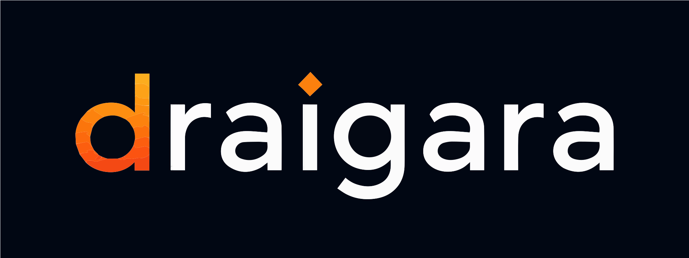

<p align="center">
  
</p>

# Draigara OpenAPM Community

Draigara OpenAPM Community is a public, curated Microsoft APM marketplace for
useful engineering plugins and skills. Its stable marketplace ID is
`draigara-openapm`. APM owns package resolution, validation, lock state, and
deployment; Forge provides the guided discovery experience.

## Get started with Forge

The simplest route installs Forge, registers this marketplace, and deploys the
global Forge plugin to the coding tools you choose:

```sh
npx @draigara/forge@next setup
```

pnpm and modern Yarn users can run the same setup without a global preinstall:

```sh
pnpm dlx @draigara/forge@next setup
# or
yarn dlx @draigara/forge@next setup
```

## Use directly with APM

Forge is optional. Register the marketplace with any APM 0.26.x client:

```sh
apm marketplace add Draigara/draigara-openapm --name draigara-openapm
apm marketplace list
```

The generated public marketplace document is also available directly:

```text
https://raw.githubusercontent.com/Draigara/draigara-openapm/main/.claude-plugin/marketplace.json
```

Install a package by its stable marketplace-qualified ID and choose only the
targets you use. For example:

```sh
apm install frontend-design@draigara-openapm --target claude,codex,copilot
```

## Preview catalogue

- `draigara-forge`: global Forge bootstrap plugin; excluded from repository
  recommendations because setup installs it as machine infrastructure.
- `superpowers`: intact upstream software-development workflow plugin.
- `frontend-design`: Anthropic's standalone frontend-design skill.
- `security-review`: GitHub's standalone repository security-review skill.
- `caveman`: upstream output-reduction skill with its token-cost tradeoff
  documented.

Each entry is pinned and reviewed individually. Provenance, upstream license,
compatibility, and review notes live under [`docs/provenance`](./docs/provenance).
Draigara does not relicense upstream work: the repository's Apache 2.0 license
applies only to Draigara-authored code, metadata, and documentation;
every referenced package retains its original license.

## Curation principles

- Prefer maintained upstream packages and immutable pins over vendored copies.
- Keep metadata factual and useful to ordinary APM clients.
- Review scripts, hooks, MCP servers, network access, and credentials at a
  higher security tier.
- Require an approved package charter before publishing a new Draigara-authored
  composition.
- Keep public packages company-neutral; organization policy belongs in a
  layered company marketplace.

## Project information

- [Contributing and running from source](./CONTRIBUTING.md)
- [Curation policy](./docs/curation-policy.md)
- [Package authoring standard](./docs/package-authoring.md)
- [Security and supply chain](./docs/security-and-supply-chain.md)
- [License](./LICENSE) — Apache License 2.0 for Draigara-authored work
- [Trademarks](./TRADEMARKS.md) — Draigara name and brand usage
